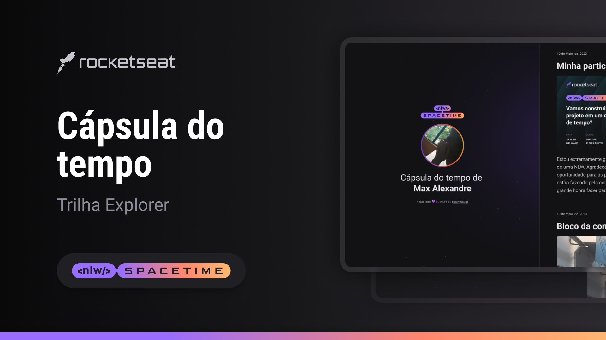

  

## 💻 Projeto

Esse é um projeto web Responsivo de uma cápsula do tempo para exibir memórias em uma linha do tempo.

## 🚀 Tecnologias

Esse projeto foi desenvolvido durante a NLW da Rocketseat com as seguintes tecnologias.

- HTML
- CSS
- Git e Github

## 🏷️ Layout

Você pode vizualizar o layout do projeto atráves
[desse link](https://www.figma.com/file/yFh6R2QWYsrmUqIVmdsgAk/C%C3%A1psula-do-tempo-%E2%80%A2-Trilha-Explorer?type=design&node-id=306%3A84&t=bpkmE8idPUTpW5Jd-1).
É necessário ter uma conta no [Figma](https://www.figma.com)
